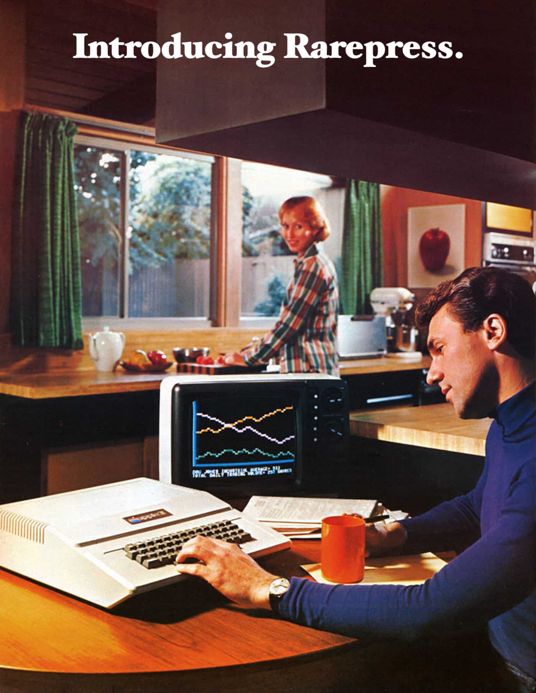
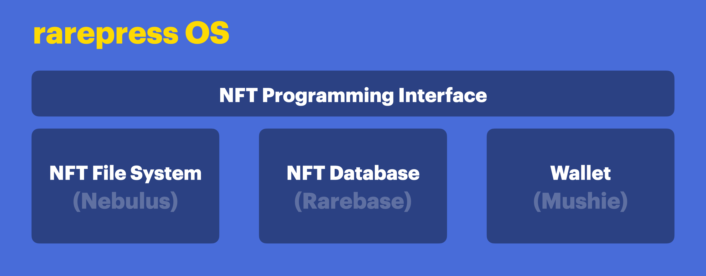
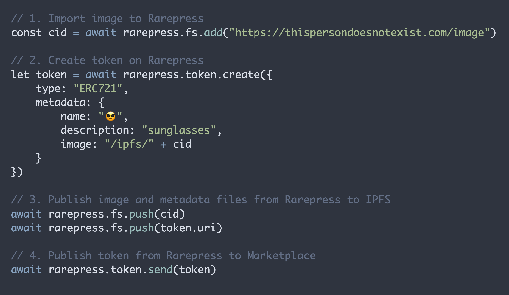
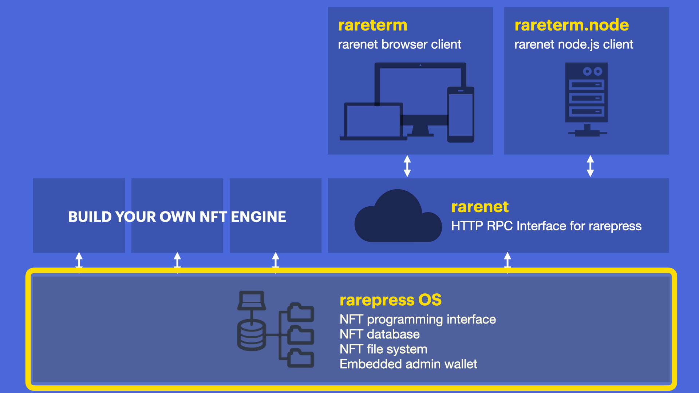
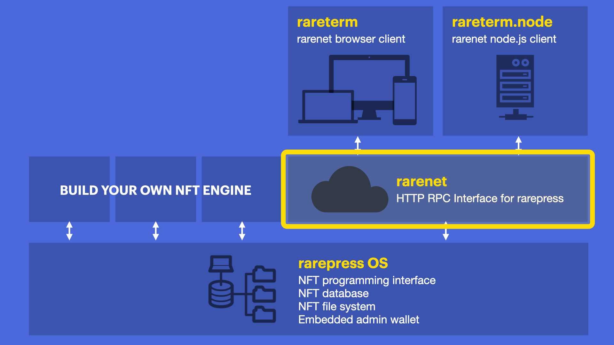
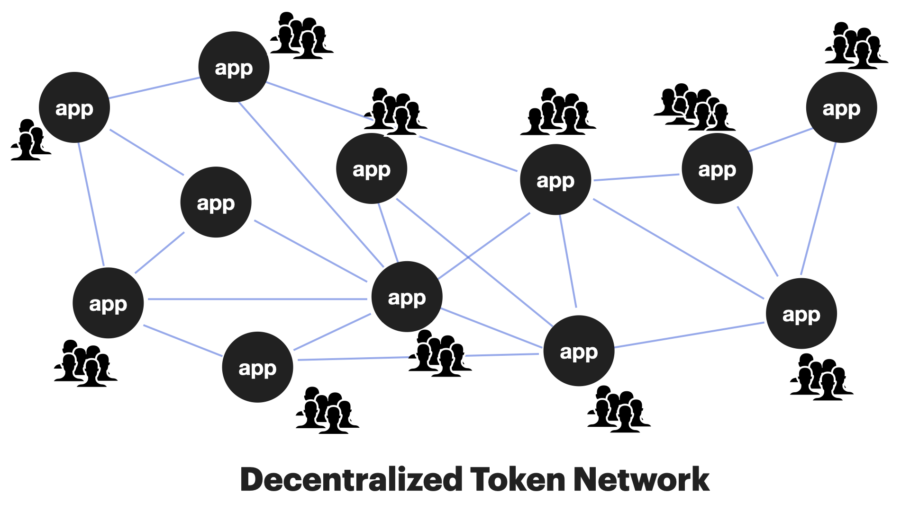
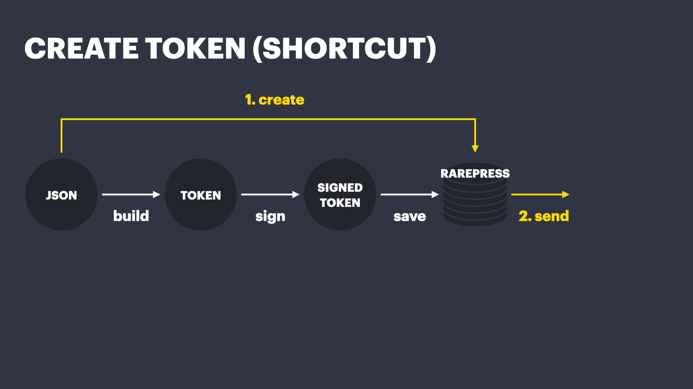
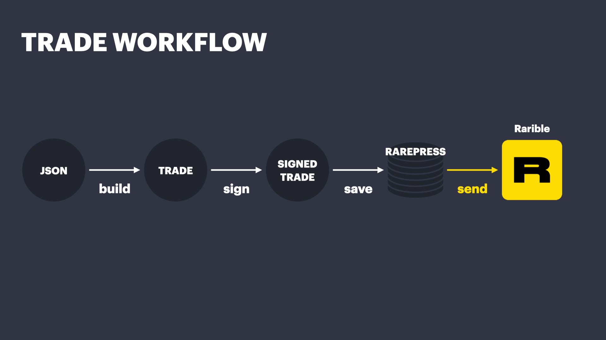

<header>
  <a href="https://rarepress.org">Home</a>
  <a href="https://twitter.com/skogard">Twitter</a>
  <a href="https://github.com/rarepress">GitHub</a>
  <a href="https://discord.gg/BZtp5F6QQM">Discord</a>
</header>

> Legacy v0 endpoint docs: https://docs.rarepress.org
>
> Examples and tutorials: https://examples.rarepress.org
>
> API reference: https://api.rarepress.org
>
> Rarepress OS documentation: https://os.rarepress.org
>
> Rarenet documentation: https://rarenet.rarepress.org


# Rarepress

## Your Own NFT Operating System



Rarepress is an open source framework that makes it easy to mint, trade and manage NFTs, as well as build NFT powered apps and engines. It ships with:

- NFT File System
- NFT Database
- NFT Programming Interface
- HTTP RPC Interface + Thin Client
- Built-in Admin Wallet

Because Rarepress utilizes a [decentralized NFT protocol](https://rarible.org) and includes everything you need to programmatically manage NFTs, you can **build your own independent NFT projects and platforms** without relying on any 3rd party.




## Why Rarepress?

### Problem

**Too difficult:** Until now, programmatically minting and trading NFTs and building NFT powered applications have been very difficult. You had to learn [Solidity](https://docs.soliditylang.org/en/v0.8.7/), [Web3](https://web3js.readthedocs.io/en/v1.4.0/), [IPFS](https://ipfs.io/), and be familiar with a lot of other blockchain-related background.

**Requires crypto:** Also before even getting started, developers needed to own the underlying cryptocurrency (for example Ether). This limits the adoption to only those who already own the cryptocurrency.

Because of these hurdles, most NFT creators have had to rely on a small number of NFT service providers who have the resources to build up the infrastructure.

It's almost like the early days of mainframe computers before personal computers were released. People connect to a "mainframe" NFT service provider for managing NFTs instead of having their own "personal NFT computer" where they have total control and expressive freedom.

### Solution

Just like how the Personal Computers revolutionized our lives by making computers accessible to everyone, we believe a completely open and permissionless operating system for easily programming NFTs will result in a cambrian explosion of innovation.

Rarepress is **a full stack NFT operating system** which abstracts away all the complex parts, so the **creators can just focus on working with NFTs and building powerful applications with nothing but JavaScipt.**

Here's an example code for minting tokens:



With Rarepress, you can create and trade your own custom NFTs in a matter of minutes without having to sign up for a NFT app, or ask for permission.

Also you can programmatically manage all your tokens and build applications powered by the NFTs using Rarepress as your backend, without relying on any 3rd party.

You can roll your own NFT engine, exactly the way you want it.


---

# Components

1. **Operating System:** Rarepress starts with `rarepress OS`, the core operating system.
2. **Network:** Through `rarenet`, rarepress systems can communicate with one another in a peer-to-peer manner through networking.

## Operating System



Rarepress OS is an Open Source Embeddable NFT operating system that ships with:

1. **NFT File System:** An NFT File System that seamlessly integrates with IPFS.
2. **NFT Database:** An NFT Database that lets you store and query token and trade objects.
3. **NFT Programming Interface:** A JavaScript based API for interacting with the file system, database, and [the underlying decentralized NFT protocol](https://rarible.org).
4. **Admin Wallet:** A built-in admin wallet.

>
> **Learn more about Rarepress OS:**
>
> https://os.rarepress.org
>

---

## Network



`Rarenet` is a web server that exposes Rarepress OS to the outside world through HTTP RPC calls.


Most people do not need to run a Rarenet node. In many cases it is enough to just use the Rarepress OS directly to manage tokens.

Rarenet is useful when you want to let others send you decentralized objects (tokens and trade positions) or remotely access your rarepress OS to manage their tokens. By exposing a server, it allows multiple users to submit token and trade objects to the underlying Rarepress OS.

Also, Rarenet can be used to create a decentralized NFT network where offchain tokens can be stored, replicated, and routed in a decentralized manner without being locked into a centralized service provider.



In such away, we can create a decentralized Internet of NFTs, which:

1. has no scaling limits
2. has no single point of failure
3. is censorship reistant
4. lets creators and businesses host and control their own NFT infrastructure and data
5. can be communicated in a Peer to Peer manner
6. can be private

>
> **Learn more about Rarenet:**
>
> https://rarenet.rarepress.org
>

---

# Use Cases

With Rarepress you can:

1. Tokenize ANYTHING into NFT.
2. Trade minted NFTs programmatically.
3. Build NFT-powered applications without relying on a 3rd party (using the built-in file system and database)

Here are some example applications you can build:

## Build your own NFT community

You no longer have to rely on some service provider to support some features, you can easily build your own NFT community. Rarepress has everything built-in that lets you manage all the tokens and trades, as well as the ability to query them to use for building NFT powered applications.

- You can use `rarenet` to run the backend for your community, and use `rareterm` (in the browser) or `rareterm.node` (with node.js) to build the frontend client for your users to interact with the operating system.

## Automated tokenization

Write a script that automatically tokenizes things on your computer upon certain events.

- You can use `rarepress` directly to build an automated tokenization engine
- You can use `rarenet` + `rareterm.node` to build the same type of app, but with multiple thin clients

## Tokenize data stream

Thanks to the built-in wallet, you can automatically tokenize a stream of data in realtime.

Imagine tokenizing IoT data, supply chain data, anything!

- You can use `rarepress` directly to build an automated tokenization engine
- You can use `rarenet` + `rareterm.node` to build the same type of app, but with multiple thin clients

## Embedded NFT engines

Embed Rarepress into existing applications. Rarepress is just node.js, so you can embed it into any JavaScript app.

- You can use `rarepress` directly to build an automated tokenization engine
- You can use `rarenet` + `rareterm.node` to build the same type of app, but with multiple thin clients

## NFT plugins for existing apps

There are many applications that let you build plugins. You can easily integrate Rarepress into these frameworks and build

- You can use `rarepress` directly to build an automated tokenization engine
- You can use `rarenet` + `rareterm.node` to build the same type of app, but with multiple thin clients

## NFT-powered applications

Thanks to the built-in database, you can easily save and query tokens WITHOUT relying on any 3rd party.

This means you can build your own NFT apps powered by your own database.

- You can use `rarenet` to power the token backend for your users, and `rareterm` to build the frontend.

## Private NFTs

Using the [file system](#file-system), you can build NFTs that can stay private, and communicate with other rarepress nodes in a peer to peer manner, or privately.

- Multiple parties can use `rarenet` to power the token backends, and they can communicate peer-to-peer using `rareterm` or `rareterm.node`.

---

# Concepts

## Decentralized Objects

What are tokens and trade positions?

In Rarepress, they are nothing more than signed messages that can settle on the blockhain in the future. Because they are simple JSON objects they are completely portable, and can be stored, replicated, and routed in a decentralized manner.

For example, if you send a token (NFT) to an NFT marketplace, the marketplace may list the token on their site.

But what if you could send the same signed token to another application in addition to the marketplace?

What if you could broadcast the same signed token to multiple applications?

Or, what if you could go all out and even publish the signed token itself on IPFS (in addition to the metadata and the image files)?

All of this is possible because tokens and trade positions are stored as declarative signed messages that can be decentralized.

Let's take a look at these portable objects.

### Token

#### Token Object

We define a "token" as **a structured object** that looks like this:

```json
{
  "@type": "ERC1155",
  "tokenId": "52103307166765014994970427877263908096137622415890453302486333077344078861865",
  "uri": "/ipfs/bafkreib2juyl6yz56v4xzomgvdxfj4fktcelcqmqvpzsqdg32wknviydpu",
  "contract": "0x1af7a7555263f275433c6bb0b8fdcd231f89b1d7",
  "creators": [
    {
      "account": "0x73316d4224263496201c3420b36cdda9c0249574",
      "value": 10000
    }
  ],
  "royalties": [],
  "signatures": [
    "0x2162c24c0b0fc6a6b4aa2250ebc841f7b80cbc8941ce385c8f0e5a7e3627216c6bfa471e2e9f5a4e830715ce51a7a1a48669460fc27cf86fcc5006297be4caf11b"
  ],
  "supply": 933764343,
  "metadata": {
    "name": "1629414367512",
    "description": "Testing",
    "image": "/ipfs/bafkreias5e66zy3knighfkgipp3sefhip6bxv7nl6g5jzccidyhbuf5p64"
  },
  "tokenURI": "/ipfs/bafkreib2juyl6yz56v4xzomgvdxfj4fktcelcqmqvpzsqdg32wknviydpu"
}
```

This is an augmented version of the structured message that the [Rarible protocol](https://rarible.org) is expecting.

1. A token is considered "minted" the moment someone signs such a structured object.
2. A token is considered "minted" even before publishing to an NFT marketplace like Rarible.com.
3. Stop thinking of an NFT marketplace as the primary place to store and manage your NFTs.
4. Start thinking of an NFT marketplaces as an aggregator that provides value by giving NFTs exposure and network effect.
5. The primary place to store and manage your tokens should be your own machine. (Rarepress is the operating system that enables that).


#### Token Database

Here's how a token object (explained in the previous section) is stored in the `tokens` table of the Rarepress NFT Database:

```json
{
  cid: 'bafkreifr7uspgan42d5hnfx5flks6fuvmmdve3qjneback3srtem63yl5a',
  tokenId: '52103307166765014994970427877263908096137622415890453302486333077344078861865',
  name: '1629414367512',
  description: 'Testing',
  image: '/ipfs/bafkreias5e66zy3knighfkgipp3sefhip6bxv7nl6g5jzccidyhbuf5p64',
  uri: '/ipfs/bafkreib2juyl6yz56v4xzomgvdxfj4fktcelcqmqvpzsqdg32wknviydpu',
  type: 'ERC1155',
  contract: '0x1af7a7555263f275433c6bb0b8fdcd231f89b1d7',
  body: '{"@type":"ERC1155","tokenId":"52103307166765014994970427877263908096137622415890453302486333077344078861865","uri":"/ipfs/bafkreib2juyl6yz56v4xzomgvdxfj4fktcelcqmqvpzsqdg32wknviydpu","contract":"0x1af7a7555263f275433c6bb0b8fdcd231f89b1d7","creators":[{"account":"0x73316d4224263496201c3420b36cdda9c0249574","value":10000}],"royalties":[],"signatures":["0x2162c24c0b0fc6a6b4aa2250ebc841f7b80cbc8941ce385c8f0e5a7e3627216c6bfa471e2e9f5a4e830715ce51a7a1a48669460fc27cf86fcc5006297be4caf11b"],"supply":933764343,"metadata":{"name":"1629414367512","description":"Testing","image":"/ipfs/bafkreias5e66zy3knighfkgipp3sefhip6bxv7nl6g5jzccidyhbuf5p64"},"tokenURI":"/ipfs/bafkreib2juyl6yz56v4xzomgvdxfj4fktcelcqmqvpzsqdg32wknviydpu"}',
  created_at: '1629414370228',
  updated_at: '1629414373237'
}
```

1. The `body` attribute is a raw JSON text of the **token object**.
2. The rest of the attributes are derived or generated from the contents of the `body` attribute.
3. The `cid` is the IPFS CID of the `body`

Each attribute represents a column. You can use the attributes to query the rarepress database.

For example if you want to query a token by `tokenId` column, you can query:

```
SELECT * FROM tokens WHERE tokenId='52103307166765014994970427877263908096137622415890453302486333077344078861865'
```

Note that Rarepress also ships with a JSON based query language that encapsulates the SQL statement in a JSON statement that can be executed locally (Rarepress) or sent over HTTP to a remote Rarepress (Rareterm) to be executed and returned as a response.

### Trade

#### Trade Object

We define a "trade" as a structured object 

```json
{
  "type": "RARIBLE_V2",
  "make": {
    "assetType": {
      "assetClass": "ERC1155",
      "tokenId": "52103307166765014994970427877263908096137622415890453302486333077344078861865",
      "contract": "0x1af7a7555263f275433c6bb0b8fdcd231f89b1d7"
    },
    "value": "933764343"
  },
  "take": {
    "assetType": {
      "assetClass": "ETH"
    },
    "value": "6000000000000000000"
  },
  "data": {
    "dataType": "RARIBLE_V2_DATA_V1",
    "payouts": [],
    "originFees": []
  },
  "salt": "162941437347258272",
  "maker": "0x73316d4224263496201c3420b36cdda9c0249574",
  "signature": "0x7f6e3f44353e6669590d39f89f5539e13e9d0197fd2ed1428c24a9111052ff7b46ef50030f0594bef748defb304ab2abcd4ac3dedac1fd3eb13d99194bc3f7e11c"
}
```

#### Trade Database

Here's how a trade object (explained in the previous section) is stored in the `trades` table of the Rarepress NFT Database:

```json
{
  cid: 'bafkreideo2d6tlbg664fn6baqtehd356kq54hji2pz7oh6u5ftt4et56vu',
  makeId: '52103307166765014994970427877263908096137622415890453302486333077344078861865',
  takeId: null,
  maker: '0x73316d4224263496201c3420b36cdda9c0249574',
  taker: null,
  body: '{"type":"RARIBLE_V2","make":{"assetType":{"assetClass":"ERC1155","tokenId":"52103307166765014994970427877263908096137622415890453302486333077344078861865","contract":"0x1af7a7555263f275433c6bb0b8fdcd231f89b1d7"},"value":"933764343"},"take":{"assetType":{"assetClass":"ETH"},"value":"6000000000000000000"},"data":{"dataType":"RARIBLE_V2_DATA_V1","payouts":[],"originFees":[]},"salt":"162941437347258272","maker":"0x73316d4224263496201c3420b36cdda9c0249574","signature":"0x7f6e3f44353e6669590d39f89f5539e13e9d0197fd2ed1428c24a9111052ff7b46ef50030f0594bef748defb304ab2abcd4ac3dedac1fd3eb13d99194bc3f7e11c"}',
  created_at: '1629414375799',
  makeType: 'ERC1155.0x1af7a7555263f275433c6bb0b8fdcd231f89b1d7',
  takeType: 'ETH'
}
```

1. The `body` attribute is a raw JSON text of the **trade object**.
2. The rest of the attributes are derived or generated from the contents of the `body` attribute.
3. The `cid` is the IPFS CID of the `body`
4. The `makeId` is the tokenId when the trade is a "make" order (when an NFT tokenId is specified as part of the `what` DSL attribute when creating a trade object)
5. The `takeId` is the tokenId when the trade is a "take" order (when an NFT tokenId is specified as part of the `with` DSL attribute when creating a trade object)
6. A "make" order (created with `what` rarepress DSL attribute) has `maker`, `makeId`, and `makeType` attributes
7. A "take" order (created with `with` rarepress DSL attribute) has `taker`, `takeId`, and `takeType` attributes
8. `makeType` or `takeType` can be any of the following:
    - `ETH`
    - `ERC1155.<CONTRACT ADDRESS>`
    - `ERC721.<CONTRACT ADDRESS>`
    - `ERC20`

Each attribute represents a column. You can use the attributes to query the rarepress database.

For example if you want to query a token by `tokenId` column, you can query:

```
SELECT * FROM trades WHERE makeId='52103307166765014994970427877263908096137622415890453302486333077344078861865'
```

Note that Rarepress also ships with a JSON based query language that encapsulates the SQL statement in a JSON statement that can be executed locally (Rarepress) or sent over HTTP to a remote Rarepress (Rareterm) to be executed and returned as a response.

## Decentralized File System

### Virtual IPFS

Rarepress internally uses [Nebulus](https://nebulus.dev), a virtual IPFS engine.


Nebulus is like Git, but for IPFS. With Git, instead of publishing everything to a central repository like SVN (A centralized version control system), you:

1. First you `add` everything locally
2. Then when you want to publish, you simply `push` the files


Likewise, instead of publishing everything immediately to the public IPFS network, Nebulus lets you take the same 2-step process: 

1. First you `add` everything locally
2. Then when you want to publish, you simply `push` the files


Just like how Git implements a distributed version control system using this 2 step approach, Nebulus also implements a "distributed IPFS" (or Offline-first IPFS) through the 2 step approach, which has benefits such as:

- Better UX
- Lets you build private NFTs
- Support NFT drafts
- Can work offline
- Selectively publish files to the public IPFS network
- Generate `tokenURI` WITHOUT publishing the content (proof of existence, mystery NFTs, etc.)

You can learn more about Nebulus here: https://nebulus.dev

### IPFS Compatible Database

It's not just the NFT files that take advantage of IPFS.

Even the database takes advantage of IPFS. Every item in the Rarepress NFT database is uniquely identified with an IPFS CID. This includes:

1. **Token Objects:** The `tokens` table has a [`cid` column](#token-database), which is derived from the `body` attribute of the stored token.
2. **Trade Objects:** The `trades` table has a [`cid` column](#trade-database), which is derived from the `body` attribute of the stored trade.

The CIDs (IPFS hashes) are generated completely offline (in the same way [nebulus](https://nebulus) generates CIDs without publishing to the public IPFS network), and instead of storing them as files, the `cid`s are stored as a database column.

Eventually these items can be published on IPFS as well, implementing a fully decentralized Internet of NFTs.

---

# Workflow

This section walks you through the lifecycle of a token and a trade object.

## Token Workflow


### 1. Build

At build step, you pass a Rarepress token DSL (Domain Specific Language) for describing a token's behavior, and get a token template (not yet signed).

```javascript
let tokenTemplate = await rarepress.token.build({
  type: "ERC721",
  metadata: {
    name: "Hello World NFT",
    description: "Testing NFT",
    image: "/ipfs/bafybeic3uyudyvsgklpyqoiy2gpvyl6znb2hxysce76iehdmf7h6xc3e7q/xasd.png"
  },
})
```

### 2. Sign

At sign step, you take the token template you have built at step 1, and sign it. The sign method returns a signed token (The same token template with signatures attached)

```javascript
let signedToken = await rarepress.token.sign(tokenTemplate)
```

In above code, the `signedToken` will let the user sign the `tokenTemplate` data and attach the signature, and return the result.

### 3. Save

At "save" step, you store the signed token generated from step 2 to Rarepress. 

This is useful when you want to save tokens as draft WITHOUT publishing to other websites like Rarible.com

```javascript
await rarepress.token.save(signedToken)
```

In above code we now store the `signedToken` into Rarepress DB. Note that the `signedToken` is locally saved on the Rarepress DB but not published anywhere else until you explicitly publish using the send command (next section)

### 4. Send

Send your signed tokens to a 3rd party endpoint. By default it is Rarible.com, but you can also specify the URL to send it to another Rarenet (A remote Rarepress endpoint) URL.

```javascript
let response = await rarepress.token.send(signedToken)
```

Above code sends the `signedToken` to a remote endpoint. By default it is sent to `rarible.com` endpoint, but you can also send it to any other URLs, such as another Rarenet endpoint.

### 5. Create

Sometimes you may want to create a token with a single command instead of having to run a sequence of `build`, `sign`, and `save`.

That's where `token.create` comes in.



Instead of going through:

1. `build`
2. `sign`
3. `save`
4. `send`

You can just do

1. `create`: takes care of `build`, `sign`, and `save` in one step.
2. `send`

## Trade Workflow

The trade workflow works similarly to the token workflow. It goes throug the `build`, `sign`, `save`, and `send` steps.



### 1. Build

At build step, you pass a Rarepress trade DSL (Domain Specific Language) for describing a trade position for a token, and get a trade template (not yet signed).

```javascript
// A token with the "tokenId" must be already saved on Rarepress 
let tradeTemplate = await rarepress.trade.build({
  what: {
    type: "ERC721",
    id: tokenId,
  },
  with: {
    type: "ETH",
    value: 10**18
  }
})
```

In above code, the `rarepress.trade.build()` command builds a trade template, yet to be signed.

### 2. Sign

At sign step, you take the trade template you have built at step 1, and sign it. The sign method returns a signed trade object (The same trade template with a signature attached)

```javascript
let signedTrade = await rarepress.trade.sign(tradeTemplate)
```

In above code, we sign the `tradeTemplate` built from step 1.

It lets the user sign the `tradeTemplate` and attaches the signature to the result and returns it.

### 3. Save

At "save" step, you store the signed trade object generated from step 2 to Rarepress. 

This is useful when you want to save trade positions as draft WITHOUT publishing to other websites like Rarible.com

```javascript
await rarepress.trade.save(signedTrade)
```

Above code saves the trade to Rarepress.

Unlike `rarepress.token.save()` which creates a new token or updates an existing token if a tokenId already exists, `rarepress.trade.save()` creates a new entry whenever there's a new trade position.

### 4. Send

Send your signed trade objects to a 3rd party endpoint. By default it is Rarible.com, but you can also specify the URL to send it to another Rarenet (A remote Rarepress endpoint) URL.

```javascript
await rarepress.trade.send(signedTrade)
```

Above code sends the `signedTrade` to Rarible.com (default endpoint). You can also specify additional URL to send it to another endpoint.

### 5. Create

Sometimes you may want to create a trade object with a single command instead of having to run a sequence of `build`, `sign`, and `save`.

That's where `trade.create` comes in.


Instead of going through:

1. `build`
2. `sign`
3. `save`
4. `send`

You can just do

1. `create`: takes care of `build`, `sign`, and `save` in one step.
2. `send`

---
